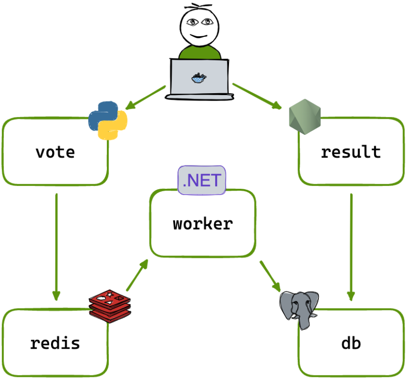

# DevOps Voting Application Project

This project demonstrates an **end-to-end DevOps implementation** of a microservices-based voting application.  
The application is containerized using Docker, orchestrated with Kubernetes, and deployed on AWS with a CI/CD pipeline using GitHub Actions.

---

# Project Architecture

The application follows a microservices architecture consisting of multiple services that communicate with each other through Kubernetes networking.

---

# Application Workflow

1. Users submit votes through the **Vote web application**
2. Votes are stored temporarily in **Redis**
3. A **Worker service** processes the votes
4. Processed votes are stored in **PostgreSQL**
5. The **Result service** reads from the database and displays results in real time

---

# Microservices Used

| Service | Technology | Purpose |
|------|------|------|
| Vote Service | Python | Frontend voting application |
| Redis | In-memory DB | Temporary vote storage |
| Worker Service | .NET | Processes votes |
| PostgreSQL | Database | Persistent vote storage |
| Result Service | Node.js | Displays results |

---

# DevOps Tools Used

| Category | Tools |
|------|------|
| Containerization | Docker |
| Container Registry | Docker Hub |
| Orchestration | Kubernetes (K3s) |
| CI/CD | GitHub Actions |
| Cloud Platform | AWS EC2 |
| Networking | Kubernetes Services & Ingress |
| Monitoring | Kubernetes Metrics Server |

---

# Kubernetes Components Implemented

This project includes several Kubernetes resources:

- Deployments
- Services
- Ingress Controller (Traefik)
- Horizontal Pod Autoscaler (HPA)
- RBAC (Role Based Access Control)
- Pod Disruption Budget
- Resource Limits

---

# CI/CD Pipeline

A CI pipeline was implemented using **GitHub Actions**.

Pipeline flow:

Code Push → GitHub Actions → Build Docker Image → Push to Docker Hub → Deploy to Kubernetes

This ensures automated container builds and consistent deployments.

---

# Project Documentation

Detailed documentation for each component can be found in the `docs` folder.

| Documentation | Description |
|------|------|
| docs/project-overview.md | Project overview |
| docs/docker.md | Docker containerization |
| docs/kubernetes.md | Kubernetes deployment |
| docs/cicd.md | CI/CD pipeline |
| docs/aws-deployment.md | AWS infrastructure setup |
| docs/troubleshooting.md | Issues faced and resolutions |

---

# Kubernetes Deployment

Application services were deployed using Kubernetes manifests.

Example:

kubectl apply -f vote-deployment.yaml
kubectl apply -f result-deployment.yaml
kubectl apply -f worker-deployment.yaml

Cluster status can be verified using:

kubectl get pods
kubectl get svc
kubectl get ingress

---

# Screenshots

Example application interface:

---

# Key DevOps Concepts Demonstrated

This project demonstrates:

- Microservices architecture
- Docker containerization
- Kubernetes orchestration
- CI/CD automation
- Cloud deployment on AWS
- Kubernetes networking and scaling
- Troubleshooting real deployment issues

---

# Author

Ajith Kumar

DevOps Engineer | Kubernetes | Docker | CI/CD | AWS
